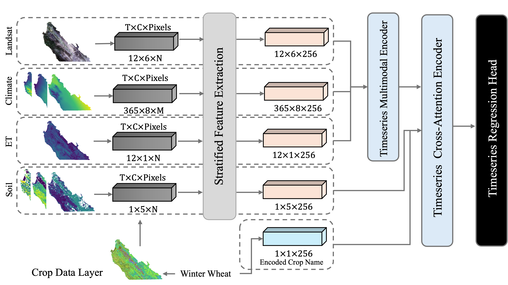

# california-crop-yield-benchmark

> **California Crop Yield Benchmark: Combining Satellite Image, Climate, Evapotranspiration, and Soil Data Layers for County-Level Yield Forecasting of Over 70 Crops**


---

## 🌾 Overview

This benchmark provides a unified, multi-modal dataset for county-level crop yield prediction across California. It integrates:

- **Landsat satellite imagery** (monthly time series)
- **Evapotranspiration (ET)** data (monthly)
- **DayMet Climate variables** (daily)
- **Soil attributes** (static)
- **Cropland Data Layer (CDL)** (yearly, pixel-wise crop classification)
- **USDA-reported county-level yield** (annual ground truth for 70+ crops)

> ✅ Designed to support machine learning research in agriculture and environmental modeling

---

## 📁 Dataset Structure

Each county follows this directory layout:

```
counties/
  └── Alameda/
        └── data/
              ├── cdl/
              ├── landsat/
              ├── et/
              ├── climate/
              └── soil/
```

---

## 🔧 Installation

```bash
pip install calicropyield
```

Or clone and install locally:

```bash
git clone https://github.com/yourname/california-crop-yield-benchmark.git
cd california-crop-yield-benchmark
pip install .
```

---

## 🧠 Quick Start

```python
from calicropyield.loader import DataDownloader

downloader = DataDownloader(target_dir="./data")

downloader.download_CDL(
    county_name=["Alameda", "Fresno"],
    year=[2022],
    crop_name=["Corn", "Alfalfa"],
    geometry=None  # Optional geometry for spatial cropping
)

# Other available methods
# downloader.download_ET(...)
# downloader.download_Landsat(...)
# downloader.download_DayMet(...)
# downloader.download_soil(...)
# downloader.download_USDA(...)
```

---

## 🗂️ Available Downloads

| Dataset     | Format | Temporal Resolution | Spatial | Source |
|-------------|--------|---------------------|---------|--------|
| CDL         | `.tif` | Yearly              | 30m     | USDA   |
| Landsat     | `.tif` | Monthly             | 30m     | USGS   |
| ET          | `.tif` | Monthly             | 30m     | OpenET |
| DayMet      | `.nc`  | Daily               | 1km     | DayMet |
| Soil        | `.nc`  | Static              | Varies  | NRCS   |
| USDA Yield  | `.csv` | Annual              | County  | NASS   |

---

## 📊 Benchmark Model

This repository is accompanied by a baseline multimodal deep learning model (coming soon) for county-level yield regression using the full stack of modalities.




---

## 📌 Paper

This dataset and benchmark are described in the paper:

**California Crop Yield Benchmark: Combining Satellite Image, Climate, Evapotranspiration, and Soil Data Layers for County-Level Yield Forecasting of Over 70 Crops**

_Link coming soon_

---

## 📷 Example Visualizations


---

## 🤝 License

BSD 3-Clause License — see [LICENSE](LICENSE)

---
## 👩‍💻 Contribution

- Contributions welcome via pull request!

---
