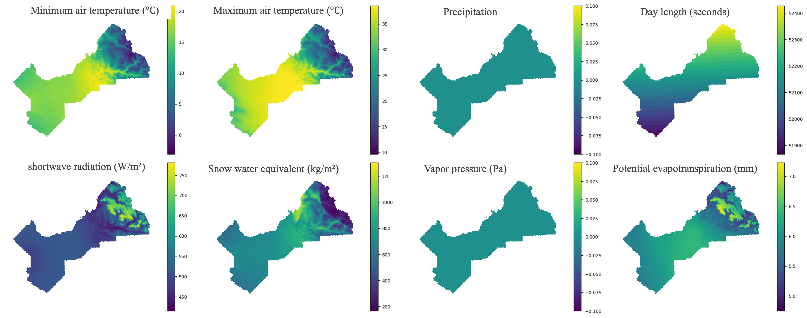

>**California Crop Yield Benchmark: Combining Satellite Image, Climate, Evapotranspiration, and Soil Data Layers for County-Level Yield Forecasting of Over 70 Crops**


<br>
This benchmark offers a comprehensive, unified, and multi-modal dataset for county-level crop yield prediction across California. It integrates diverse data sources, including monthly time series from Landsat satellite imagery, monthly evapotranspiration (ET) data, daily DayMet climate variables, static soil attributes, annual Cropland Data Layer (CDL) for pixel-wise crop classification, and USDA-reported county-level yield data for over 70 crops. Designed to support machine learning research in agriculture and environmental modeling, this dataset enables robust analysis and development of predictive models across spatial and temporal scales.
<br>

[](https://arxiv.org/abs/2506.10228)
[](https://huggingface.co/datasets/hkaman/california-crop-yield-benchmark)
[](https://openaccess.thecvf.com/content/CVPR2025W/V4A/papers/Kamangir_California_Crop_Yield_Benchmark_Combining_Satellite_Image_Climate_Evapotranspiration_and_CVPRW_2025_paper.pdf)


---

## 📁 Contribution 
The **calicropyield** dataset
- The first terabyte-sized, publicly available, and multi-modal dataset for california climate change-aware crop yield predictions
- The calicropyield dataset is available at [Google Drive](https://drive.google.com/drive/folders/1Ci_LlLF1-hcLt898CTbyYnYTFPZNWlUe?usp=sharing)

The  **calicropyield** package
- A deep learning-ready Python package for facilitating researchers in downloading the calicropyield data on the fly over the time and region of interest, and developing deep neural networks (DNNs) for climate change-aware crop yield predictions
- The calicropyield package is available at Python Package Index (PyPI)

---

Each county follows this directory layout:

```
counties/
  └── Alameda/
        └── data/
              ├── cdl/
              ├── landsat/
              ├── et/
              ├── climate/
              └── soil/
```

## 🗂️ Available Downloads

| Dataset     | Format | Temporal Resolution | Spatial | Source |
|-------------|--------|---------------------|---------|--------|
| CDL         | `.tif` | Yearly              | 30m     | USDA   |
| Landsat     | `.tif` | Monthly             | 30m     | USGS   |
| ET          | `.tif` | Monthly             | 30m     | OpenET |
| DayMet      | `.nc`  | Daily               | 1km     | DayMet |
| Soil        | `.nc`  | Static              | Varies  | NRCS   |
| USDA Yield  | `.csv` | Annual              | County  | NASS   |

---

## 📷 Example Visualizations




---
The calicropyield package
Beyond the contribution of our california crop yield dataset, we also release the calicropyield package in the Python Package Index (PyPI) for facilitating researchers in downloading the california crop yield benchmark data based on the time and region of interest, and flexibly building their deep learning models for accurate crop yield predictions. In particular, the calicropyield package includes three types of APIs, listed as follows:

**DataDownloader**: This API allows users to download the calicropyield data over the time/region of interest on the fly and stored in the local machine (e.g., if you have downloaded our curated calicropyield from Google Drive) over the time/region of interest.

**DataLoader**: This API is designed to facilitate researchers in developing their DNNs for accurate crop yield predictions. Specifically, the code in this API (1) combines all four modalities of data to create tuples, with appropriate, respectively representing satellite images, daily whether parameters, ET, Soil and ground-truth crop yield (or production) information, and then (2) exposes those tuples via a Dataset object after appropriate data pre-processing techniques.

## 🔧 Installation

```bash
pip install calicropyield
```

---

## 🧠 Quick Start

```python
from calicropyield.loader import DataDownloader

downloader = DataDownloader(target_dir="./data")

downloader.download_CDL(
    county = ["Alameda", "Fresno"], # List of county names
    year = [2022], # List of years
    crop = ["Corn", "Alfalfa"], # List of crop names
    geometry = None  # Optional geometry for spatial cropping
)

downloader.download_Landsat(
    county_names = ["Alameda", "Fresno"], 
    years = [2019, 2022], 
    geometry = None)

# Other available methods
downloader.download_ET(county_names: list = None, years: list = None, geometry = None)
downloader.download_Climate(county_names: list= None, years: list = None, variables: list = None, geometry=None)
downloader.download_Soil(county_names: list= None, variable: list = None, geometry=None)
downloader.download_USDA(county_names: list= None, years: list = None, crop_names: list  = None)
```
---
## 📚 Tutorials

The tutorials for the California Crop Yield Benchmark are available in Google Colab, with their links listed below:

- [📗 Download CDL Data](https://colab.research.google.com/github/<username>/<repo>/blob/main/tutorial/download_cdl.ipynb)
- [📘 Download Climate Data](https://colab.research.google.com/github/<username>/<repo>/blob/main/tutorial/download_climate.ipynb)
- [📙 Download ET Data](https://colab.research.google.com/github/<username>/<repo>/blob/main/tutorial/download_et.ipynb)
- [📕 Download Landsat Imagery](https://colab.research.google.com/github/<username>/<repo>/blob/main/tutorial/download_landsat.ipynb)
- [📒 Download Soil Attributes](https://colab.research.google.com/github/<username>/<repo>/blob/main/tutorial/download.soil.ipynb)
- [📓 Download USDA Yield Data](https://colab.research.google.com/github/<username>/<repo>/blob/main/tutorial/download_usda.ipynb)


---

## 📌 Citation

If you use this dataset or benchmark in your work, please cite our paper:
```
@InProceedings{Kamangir_2025_CVPR,
    author    = {Kamangir, Hamid and Hajiesmaeeli, Mona and Earles, J. Mason},
    title     = {California Crop Yield Benchmark: Combining Satellite Image, Climate, Evapotranspiration, and Soil Data Layers for County-Level Yield Forecasting of Over 70 Crops},
    booktitle = {Proceedings of the Computer Vision and Pattern Recognition Conference (CVPR) Workshops},
    month     = {June},
    year      = {2025},
    pages     = {5491--5500}
}
```

## 🤝 License

BSD 3-Clause License — see [LICENSE](LICENSE)

---
## 👩‍💻 Contribution

- Contributions welcome via pull request!

---
